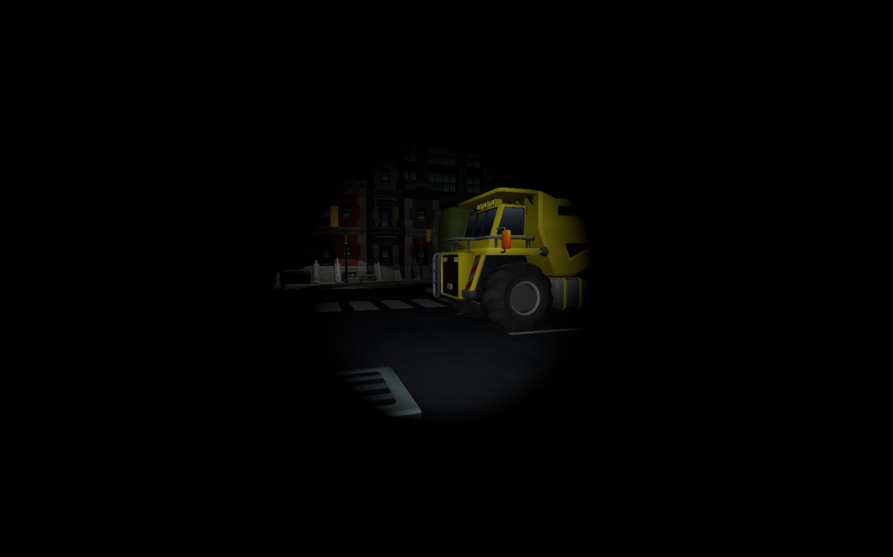
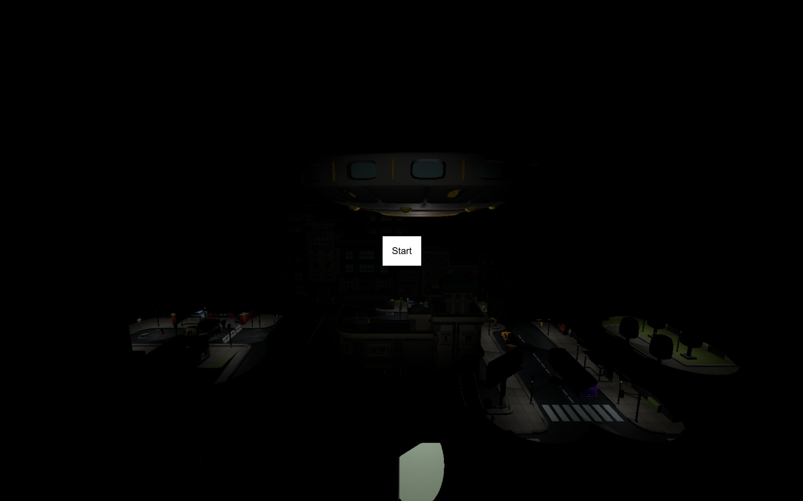
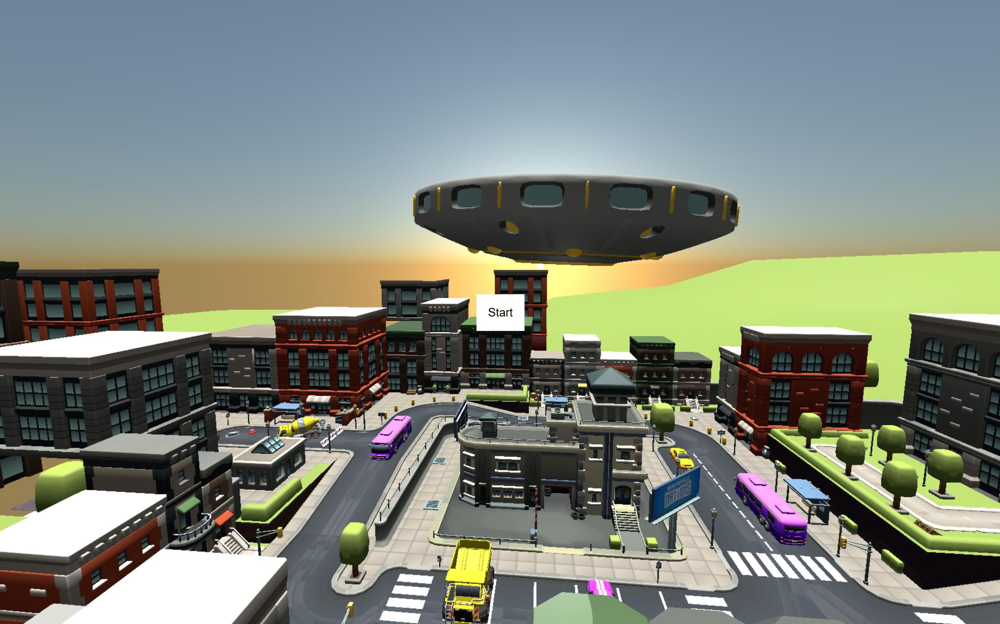

# project_DT082a

### This is a school project created by Taha Khudher and Fredrik lindström.

This project is a game where an alian invasion has occured the aliens are looking down on you and trying to take you away, but you are the last hope to save this town, find the red button press it and bring light back to the city.

To your aid you have a flashlight you can use to be able to see in the dark.

### To run this project
To run this project install the needed dependencies vite, and three.js.

Npx vite to run the project on local host.

## Credits
This work is based on "Invasion Map - miniroyale.io" (https://sketchfab.com/3d-models/invasion-map-miniroyaleio-89f52d6ee9344cc48060076c222ad40b) by zct_33 (https://sketchfab.com/zct_33) licensed under CC-BY-4.0 (http://creativecommons.org/licenses/by/4.0/)

